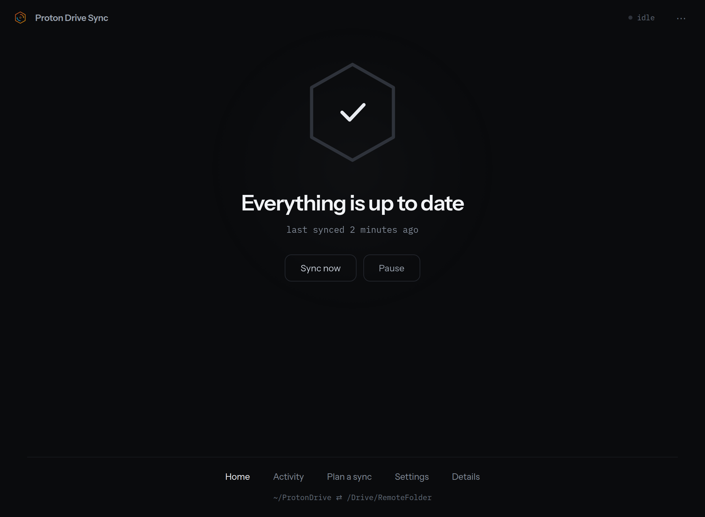

**Proton Drive Sync** is a desktop app for Linux, built with [Tauri](https://tauri.app/).
It gives the daemon a face: live status, an activity ledger, side-by-side conflict
resolution, a dry-run review before destructive passes, settings, a first-run takeover, and
a system-tray indicator.

*The app at rest. Nothing here is coloured to get your attention — the design keeps that for
the things that want a decision, so a tint anywhere on screen means something is waiting.*

## It's a thin client

The app owns **no sync logic and no index of its own**. Everything it shows comes from the
daemon's real surface:

| Source | Supplies |
| --- | --- |
| Control socket (`$XDG_RUNTIME_DIR/proton-sync.sock`) | Live status, history, pending deletions, and the daemon's control verbs — `pause` / `resume` / `syncnow` / `resync` / `approve` / `deny` / `keep` / `shutdown`, plus the `plan` / `plan_result` / `apply` family for a reviewed dry-run. See the [CLI reference](/cli/reference/) for the full list. The app's own screens never call `deny` — reversing a withheld deletion goes through **Keep it** instead (see [Screens](/desktop/screens/#deletions)), which purges the record rather than merely revoking an approval; `deny` is there for `proton-sync deny`. |
| Config file (`~/.config/proton-sync/proton-sync.toml`) | Everything in **Settings** except Notifications (below). The app edits this file in place. |
| `.proton-cloud` sidecars on disk | Conflict resolution — plain file operations, no new IPC verb needed. |
| The daemon's `plan` / `plan_result` / `apply` verbs, with `proton-syncd --dry-run` as a fallback | The **Plan preview** and the onboarding review. The daemon computes it whenever one is up and its reported roots agree with the app's config. The `--dry-run` child runs instead whenever that condition fails — no daemon to ask (onboarding, before one exists) or a daemon that is up but reporting a different pair (Settings changed, not yet restarted onto it) — and a plan from the child carries no token, so it can only be applied wholesale, never with a deletion filtered out. |
| The SQLite index (read-only) | File-manager emblems (shipped as separate per-distro packages, not by the app itself), plus the app's own Activity file lookup and deletion cards. |

Because the app reads the same socket and files as the CLI, the two never disagree. Closing
the app's window **never stops the daemon** — the window hides to the tray and syncing
continues. Quitting from the tray **does** stop it: the daemon gets its own graceful shutdown
first, then the app process ends.

Settings has one exception to "the config file supplies everything": the Notifications tab
writes `notify_policy` to a second, GUI-local `gui.toml` beside the daemon's config. The
daemon never reads it and never sees the setting.

## How it stays current

The app polls the daemon's `status` on a timer — **every 2 seconds when focused, every 10
seconds when in the background** — plus a periodic conflict re-scan and a refresh of pending
deletions. A socket error is its own explicit state; **counters never render as a
misleading zero** when the daemon is unreachable — they show an em-dash instead.

## The seven daemon states

Both the window and the tray derive one shared **daemon state** from the status reply (or
its absence), so they always agree. Each state drives the headline, the available actions,
the tray icon, and whether counters are shown:

| State | Meaning | Primary actions offered |
| --- | --- | --- |
| **Running** | Reachable, not paused, changes pending — actively syncing. | Pause (Sync now disappears mid-sync — it would do nothing) |
| **Idle** | Reachable, not paused, nothing pending — up to date. | Sync now, Pause |
| **Paused** | Sync is paused. The daemon remembers it, so a restart (including the one after saving settings) keeps the pair paused, unless the pause was made while the pair was unavailable: that pause is kept in memory only. To make it stick, resume the pair once its folder is back and pause it again. | Resume |
| **Auth expired** | The daemon's own sign-in verdict says the Proton session is gone — or, only while it has no verdict yet, a fallback match against the last error's wording. | Try again now |
| **Failed** | Reachable, but the last pass failed for some other reason — a timeout, a missing `proton-drive` binary, a transfer error. | Try again now |
| **Unreachable** | The control socket can't be reached, or the reply couldn't be trusted. | Start the sync service |
| **First run** | Nothing has synced yet. | None — the onboarding takeover covers the window; there is no Home screen to offer buttons on |

**Failed** is the state most worth naming explicitly. Without it, every kind of failure used
to fall through to **Idle**, and the app drew "Everything is up to date" over a pass that had
not finished — the same mistake the engine's own #246 fixed. The reply's counters are the
daemon's own and are not blanked in this state; only the state itself used to be misread.

Nothing in the app can sign you in — an expired session is fixed by running
`proton-drive login` yourself in a terminal, which is why **Auth expired** offers no
sign-in button of its own.

In the **Unreachable** and **First run** states, counters render as **em-dashes** rather
than a fake zero — unknown is not zero.

## Actions the app shows vs. runs

The app runs almost everything itself: sync commands over the socket (`sync now`, `pause`,
`resume`, approve/keep deletions, resolve conflicts, edit the config), and a couple of
system-level actions it runs directly rather than asking you to type them — starting the
service (`systemctl --user start proton-syncd`) and writing a
`journalctl --user -u proton-syncd` snapshot that it opens for you.

## Honest about the engine's limits

The app is careful not to imply capabilities the daemon doesn't have. A few examples you'll
notice:

- **Neither transfer direction shows a bar or a percentage.** An upload's size is known
  upfront, but the CLI reports no progress while it runs; a download's bytes-so-far are
  sampled live from the staging directory, but a remote listing carries no file size, so its
  total is unknown. Since neither direction ever has both numbers, the app shows transfer
  rows — file names, sizes when known, and counts — rather than a bar or a fraction it would
  have had to invent.
- **Applying a reviewed plan is a fresh pass.** Dry-run and the real reconcile are separate
  invocations, so the applied plan can differ from the reviewed one — the app says so.
- **The window is about one folder pair at a time.** The daemon can sync several local↔remote
  pairs from one config (see [Multiple folder pairs](/daemon/folder-pairs/)). When it runs two or
  more, a **folder pill** appears in the header, right of the app name, and names the folder
  the window is about; pressing it (or Down, from the keyboard) lists the folders, each with a
  word for its state and a count of what is waiting in it, and choosing one moves the whole window
  to it — the status chip, the attention band, Deletions, Conflicts, Plan a sync, Activity and
  Settings all follow. A hollow ring on the pill means *another* folder has a conflict or a deletion
  waiting on you, and a solid red dot means another folder has a problem — its last sync did not
  finish, or its folder is not there (an unplugged drive). A folder you paused yourself marks
  nothing, and if both apply the red dot is the one shown. While the daemon is not answering, the
  list says every folder is *unreachable* rather than repeating what it last knew. The chip and the
  band count the folder on screen only. A list of more than eleven folders scrolls. With one folder
  there is no pill, and nothing about the window changes. The hero's button names its folder at two or
  more (`Pause photos`), and a pause the daemon could not write down is said under the hero. The
  app adds and removes folders itself (see [Adding and removing a folder](/desktop/screens/#adding-and-removing-a-folder)),
  and the **tray** lists every pair with a
  pause row for each (see [Two or more folders](/desktop/tray/#two-or-more-folders)). The
  **notifications** name the folder they are about — the line above a banner reads `Drive Sync · photos`
  — and their buttons act on that folder, whichever one the window is showing: *Keep them* keeps that
  folder's deletions and no other's, *Review* and *Compare* switch the window to it before they open
  the screen, and *Try again now* syncs that folder alone. Each folder has its own memory of what it has
  said, so adding a second folder does not repeat what the first already said, and one banner is on
  screen at a time whatever it is about. With one folder a banner is exactly what it always was.
  If your config has more than one pair, whether the app wrote it or you did, know that:
  - Settings edits the chosen folder's own `[[pair]]` table for a per-pair setting (the folders,
    skip rules, deletion policy) and the top level of the file for a daemon-wide one (log level,
    the socket, the CLI path). A file that writes its pairs as an inline array
    (`pair = [{ … }]`) is read but not edited: a per-pair save is refused, saying the app edits
    `[[pair]]` tables only.
  - a folder that is in your config but not yet in the running daemon (you edited the file and have
    not restarted) shows a note under the hero with a **Restart syncing** button — but only for the
    folder this window remembered as the one it was showing, which the daemon then cannot show. A
    folder you never chose in this window gets no note, and neither does a remembered folder the
    file no longer lists.
  - the daemon logs a warning once at startup when it finds more than one pair configured.

Continue to [Screens](/desktop/screens/) for a tour of each view, or
[Tray & notifications](/desktop/tray/) for the background indicator.
