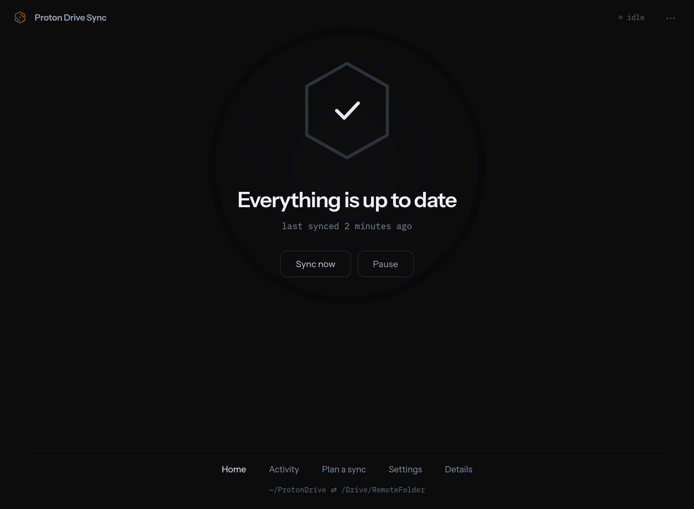
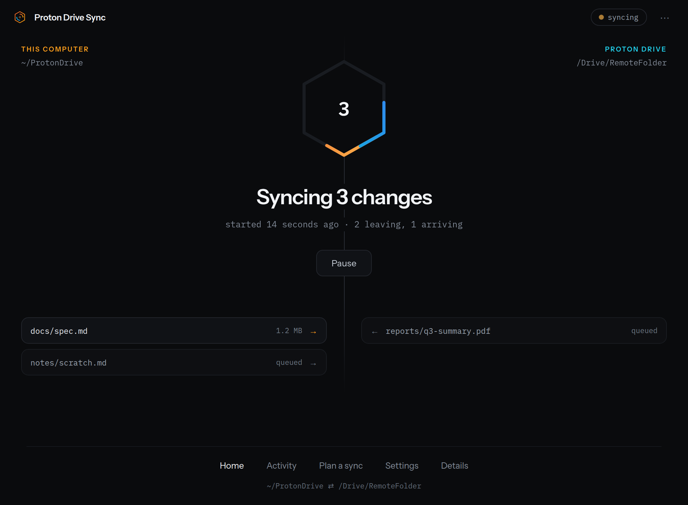
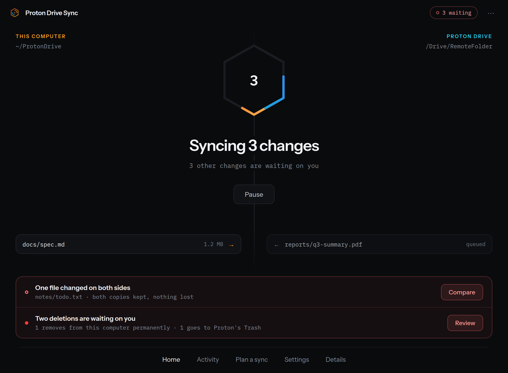
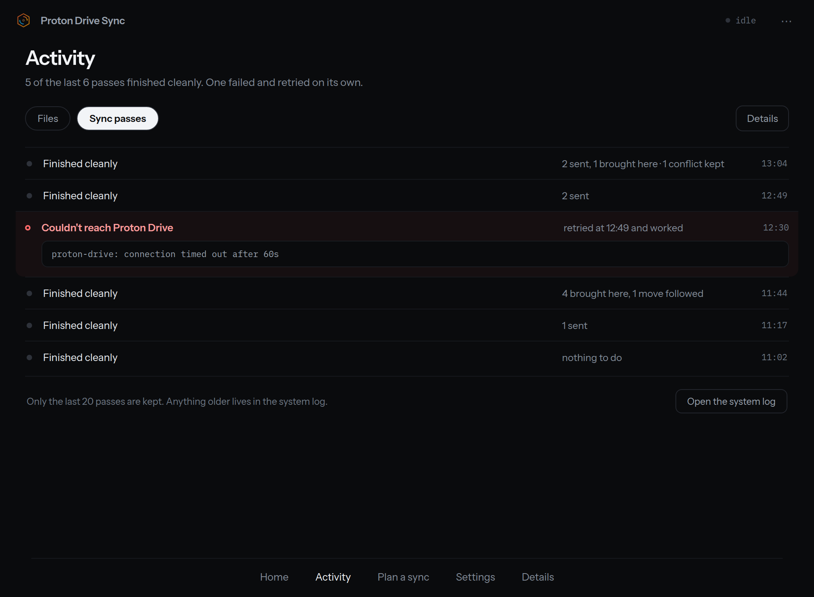
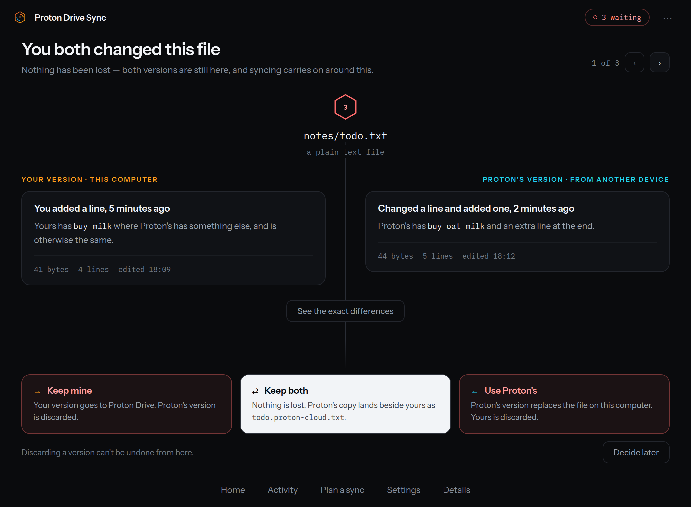
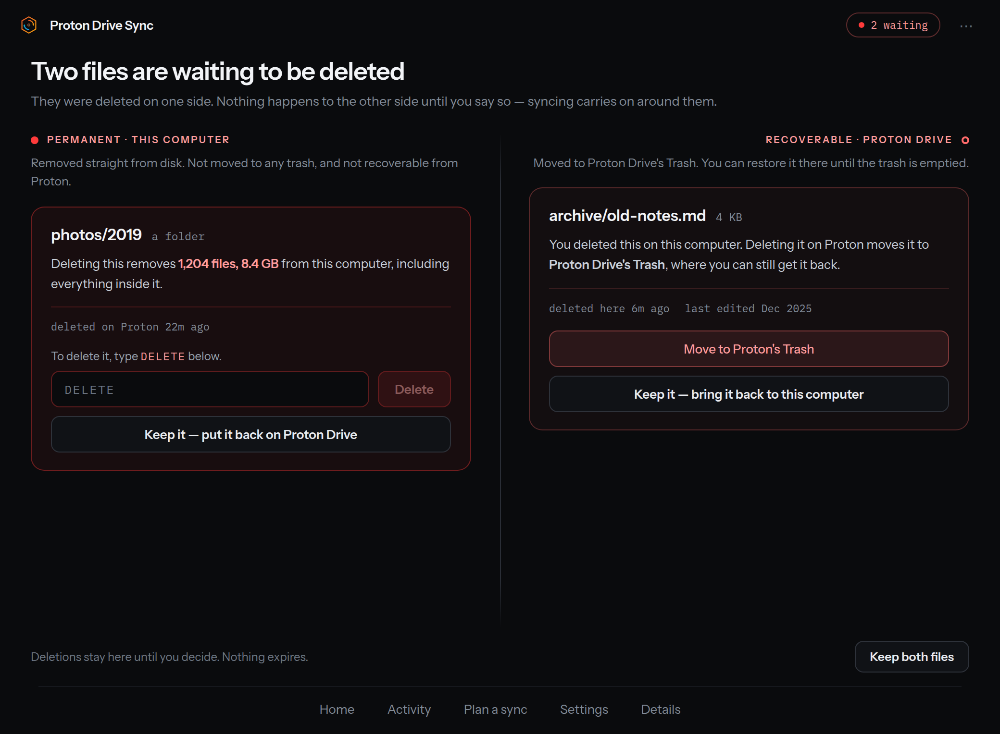
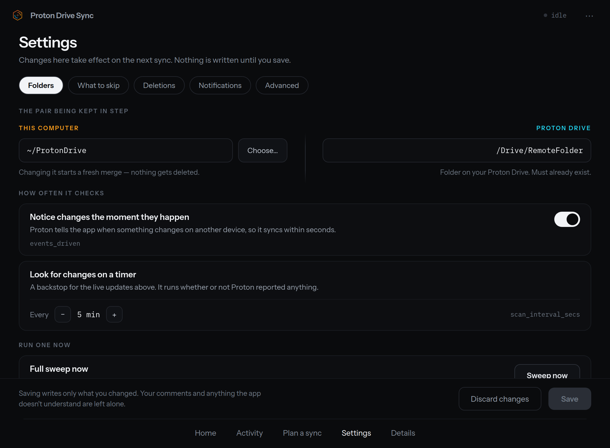
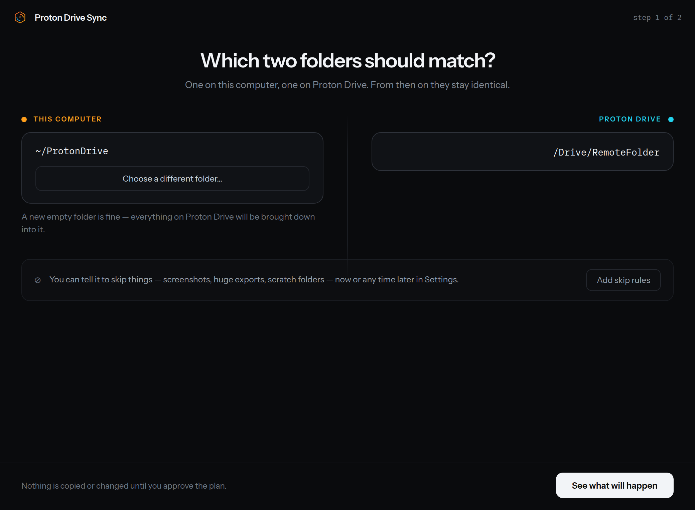
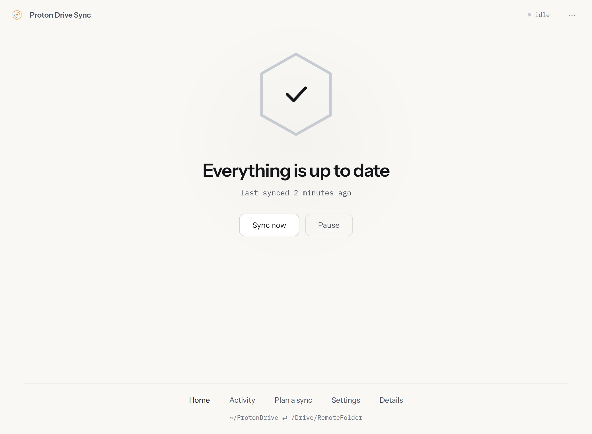

The window is a fixed 1040×764 and does not resize, so every picture below is the whole app.

There is no sidebar. A 52px header carries the app mark, the name, a **status chip** and a `⋯`
menu whose single item switches the theme. A footer carries five **doors** — **Home**,
**Activity**, **Plan a sync**, **Settings**, **Details** — and, on Home, a mono line naming the
folder pair. Conflicts and Deletions have no door: they open over whatever you were looking at,
from the attention band on Home, or from a notification.

The status chip is the one place the [daemon state](/desktop/overview/#the-six-daemon-states)
is always visible. It reads `idle`, `syncing`, `paused`, `unreachable`, `sign-in expired`,
`sync failed`, `first run`, `{n} waiting`, `rehearsal · nothing has changed` while a plan is
open, or `step 1 of 2` during first-run setup. When it reads `idle` the header mark and name
dim — the design's rule is that nothing carries colour unless it wants you.

## Home

*Is it working, does it need me, and is anything waiting.* One hexagon, one headline, one
sub-line.

At rest there is no colour anywhere on the screen. The hexagon draws no number, and the
buttons are **Sync now** and **Pause**.

While a pass runs, the hexagon carries the transfer count, a **seam** joins two labelled
columns — *This computer* on the left with its local root, *Proton Drive* on the right with its
remote root — and up to six **transfer rows** name the files moving, each with an arrow for its
direction. A row's chip is `queued`, a byte size, or `{n} files` for a batched download, and a
`+n more` line closes the right column when there are more than fit.

There is deliberately **no progress bar and no percentage**, in either direction. A remote
listing carries no usable file size, so a download knows its bytes-so-far but not its total,
and an upload knows its total but reports no progress — neither side has both numbers, so the
app shows neither rather than drawing a bar that means nothing.

**Sync now** disappears while a pass is running. There is no *Re-authenticate* button: nothing
in the app can sign you in, so an expired session offers **Try again now** and the sign-in
stays `proton-drive login` in a terminal.

When something needs a decision, an **attention band** appears above the footer with one row
**per category** — not per item. Conflicts read *"One file changed on both sides"* over
*"notes/todo.txt · both copies kept, nothing lost"* — the note always names the file — with a
**Compare** button; deletions read *"Two deletions are waiting on you"* over *"1 removes from
this computer permanently · 1 goes to Proton's Trash"* with a **Review** button. Both buttons only navigate; neither acts.

## Details

The four counters live in a dialog behind the **Details** door, not on Home: pending changes,
conflicts, destructive actions and skipped-unsupported. Four more rows sit under them — the
scan interval, whether the event stream is on, where the pass list came from, and whether the
control socket is connected.

When the daemon is unreachable the four counters and the pass-list source render an em-dash
rather than a zero — unknown is not zero. The socket row reads `disconnected`, and the scan
interval and event-stream rows go on showing what the config file says, because they are read
from disk rather than from the daemon.

## Activity

Two tabs. **Sync passes** lists recent passes newest-first — a clean one reads
`Finished cleanly` with counts composed from what actually landed (`2 sent, 1 brought here ·
1 conflict kept`), a failed one shows the daemon's own error string and, if a later pass
recovered, that it retried and worked. The foot states the limit honestly — the daemon keeps
the last 20 passes in the status history — and an **Open the system log** button writes a
`journalctl` snapshot and opens it rather than printing a command for you to copy.

**Files** is a per-path lookup: type a path and the screen says whether it is synced, modified,
in conflict, or not in the index at all — the lookup reads the index, so a file that has never
synced is not there to find, and it answers *"No file by that name in your sync folder."* Files
that have never synced are listed separately, in a band on the quiet view. Read-only.

## Conflicts

One file at a time, with a `1 of 3` pager rather than a list; the rest of the queue appears as
a *"Still waiting after this one"* list inside the comparison. Each side shows size, line count
and edit time; **See the exact differences** opens a line-level diff for text files. A binary or
oversized file shows metadata only — no file content is ever invented.

The sentence at the top of each card is the exception, and it is a **placeholder**. "What you
changed" is a claim against the last agreed version, whose bytes exist nowhere on the machine —
the index keeps that version's SHA-1 and not its content — so nothing in the app can compute it.
Until something records a common ancestor, both cards draw a fixed sentence regardless of the
file. Read the diff and the metadata under it, not that line.

Four choices, and **each one writes immediately** — there is no staging and no Apply button:

| Choice | Effect |
| --- | --- |
| **Keep mine** | Deletes the sidecar; your local file uploads next pass. |
| **Keep both** | Renames yours to `name.local.ext` and keeps Proton's too. |
| **Use Proton's** | Replaces your file with Proton's copy. |
| **Decide later** | Writes nothing; the file stays outstanding. |

Choosing auto-advances to the next unresolved file. The outstanding count is computed once and
shown identically in the status chip, the attention band, and notifications.

See [Conflicts](/safety/conflicts/) for what the engine does before you get here.

## Deletions

The [delete-approval](/safety/delete-approval/) queue. A withheld deletion lands here instead
of running, and the two directions are drawn as **two columns that never look alike**, because
they are not the same action:

- **Permanent · this computer** — already deleted on Proton Drive. Approving removes the local
  file straight from disk, with no trash and no undo; for a folder the card names how many
  files and how many bytes go with it. This is the only card that makes you **type `DELETE`**.
- **Recoverable · Proton Drive** — already deleted locally. Approving moves the Proton Drive
  copy to Proton's **Trash**, where it stays until the trash is emptied. One button:
  **Move to Proton's Trash**.

Refusing is **Keep it** — *put it back on Proton Drive* / *bring it back to this computer* —
which is not the same as revoking an approval: it purges the baseline record and its subtree so
the surviving side is adopted back. The only bulk action is **Keep both files**, and it is the
safe one; there is no *Approve all*. Each card is busy independently, so one decision in flight
never freezes the other column. Nothing expires — items stay until you decide.

## Plan a sync

A rehearsal of the next sync. The status chip reads `rehearsal · nothing has changed` for as
long as the screen is open, and nothing on it has happened yet.

The head counts each direction, then **every action in order** — a glyph, the path, and what
becomes of it in plain English (`sent to Proton`, `brought to this computer`,
`deleted for good on Proton`, `folder created on Proton`, `record cleared, no file touched`).
Destructive rows are tinted and sorted first, so a deletion can never be scrolled past.

Applying is gated:

- A plan containing a real delete (`remote_delete` / `local_delete`) leaves **Run this sync**
  inert until you type `DELETE` — case-sensitively — into the box beside it. **Run it without
  the deletion** sits beside it and runs everything else — but only when the daemon is holding
  the plan. A plan computed by the `proton-syncd --dry-run` child, which is what happens during
  first-run setup before a daemon exists, carries no token and offers no filtered run.
- The red band names the file when there is exactly one deletion, and collapses to a count
  when there is more than one.
- A **purge-only** plan is not gated at all: a purge clears an index record and touches no
  file.

When the daemon holds the plan, applying names its **token**, not its rows: the daemon re-plans
and compares, and if the world moved under your review it executes nothing, publishes the fresh
plan, and keeps you on this screen. A tokenless plan has nothing to name, so applying it is an
ordinary `syncnow` and you land back on Home. See [Dry-run preview](/safety/dry-run/) for the same computation as JSON.

## Settings

Edits the daemon's TOML config directly, in five tabs:

| Tab | Holds |
| --- | --- |
| **Folders** | The pair (`local_root`, `remote_root`), the `events_driven` toggle, `scan_interval_secs`, and **Sweep now** (a full-tree resync). |
| **What to skip** | The `exclude` rules, one per row with a live count of what each currently hides. |
| **Deletions** | Three radio cards writing `deletion_policy` — ask every time, only permanent, never — applying to **both** directions. |
| **Notifications** | The notify policy. This one is GUI-local: it is written to the app's own `gui.toml` and the daemon never sees it. |
| **Advanced** | `include` ("only sync these"), the `proton_cli` path, `conflict_suffix`, `log_level`, and the config file path. |

Saving writes **only the fields you changed**, preserves your comments and any daemon-only
keys, and refuses anything the daemon's own parser would reject — so a save cannot leave you
with a config the daemon will not start on. The file is written atomically at mode `0600`.

The daemon only reads its config at startup, so **a successful save restarts it for you**: it
asks the running daemon to exit gracefully over IPC (which works however it was launched),
waits for the socket to go quiet, then starts it again — via the systemd unit when installed,
else by spawning `proton-syncd` directly against the saved config.

A restart has five endings, and the screen says which one happened rather than one sentence
covering all of them:

- **It restarted.** The service is running your new settings.
- **It was not running**, so nothing was started; it picks the new settings up whenever you
  next start it. A save is not a request to begin syncing.
- **It stopped and would not start again.** Nothing is syncing — commonly no systemd unit and
  no `proton-syncd` on `PATH`. A **Restart it now** button stays.
- **It never stopped** (an eight-second wait). The old process is still running on the old
  settings, with the new ones on disk in front of it. **Restart it now** stays.
- **It could not be told apart** — the socket neither answered nor proved it was absent.
  Nothing was restarted, and the screen says only that.

If a counted sync is running while you have a **daemon-config** change staged, the footer warns
you before **Save**: that save restarts the daemon, which stops the pass, and it starts again on
the new settings. A staged Notifications change draws no warning, because it writes the app's
own file and restarts nothing.

## First run

When nothing has synced yet, a takeover covers the window — no doors, no `⋯` menu, and a
`step 1 of 2` chip in place of the status chip. **Step 1** picks the two folders. **Step 2**
runs a dry-run and shows the merge it produces; a **consent** dialog then gates *Start syncing*
on an explicit acknowledgement that deletions propagate in both directions.

The copy is explicit that a **first sync is a non-destructive merge** — local-only files
upload, remote-only files download, matching files link, differing files are kept as both — and
that **nothing is deleted on the first pass**.

Detours from inside the takeover let you set skip rules or read every action before agreeing.
If the `proton-drive` binary will not run, a dialog says so rather than the flow guessing why.
Once the daemon is up, the app hands off out of the takeover on its own — including when the
first pass *fails*, which releases you onto Home's **Try again now** rather than trapping you.

## Light theme

Every screen has a light form. It follows the desktop by default and is switched explicitly
from the single item in the `⋯` menu.
